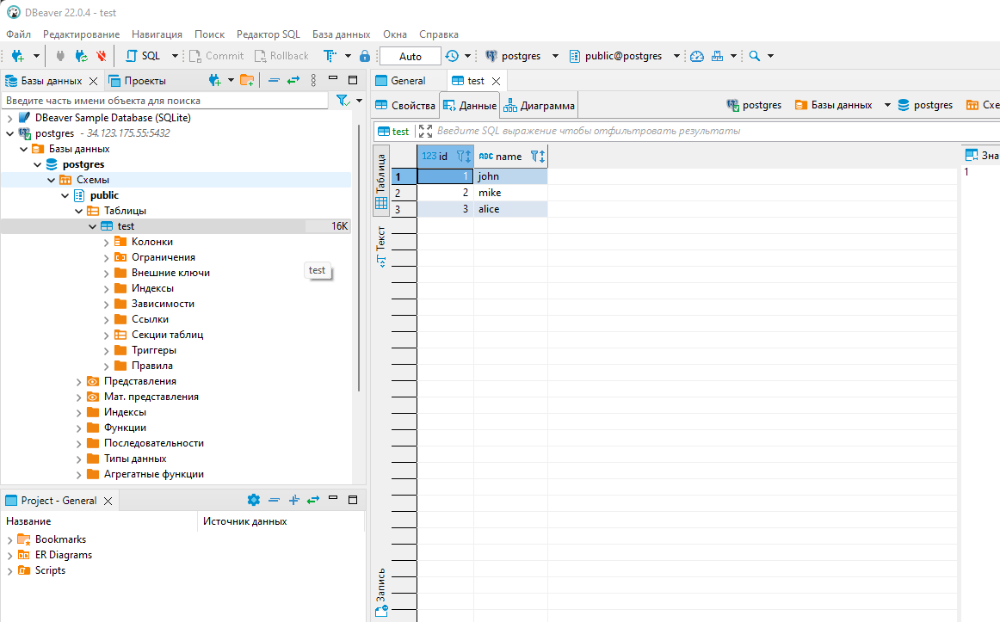
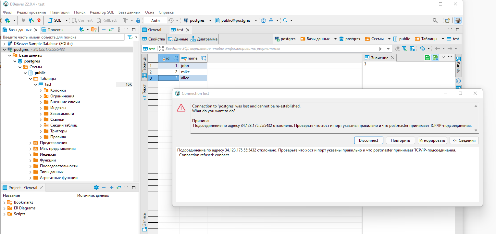
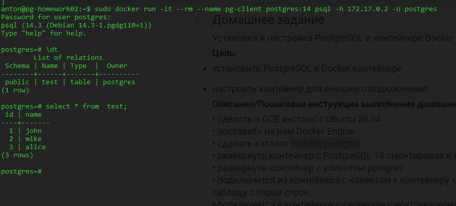
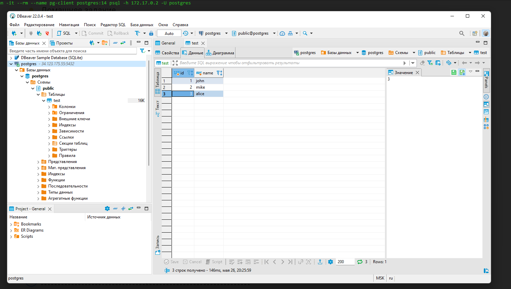

# Домашняя работа 2
## Установка и настройка PostgteSQL в контейнере Docker
Создал инстанс pg-homework02 c Ubuntu 20.04 в проекте postgres2022-19880518	и установил обновления
```
sudo apt-get update
sudo apt-get upgrade
```

Установил Docker Engine
```
sudo apt-get install ca-certificates curl gnupg lsb-release
sudo mkdir -p /etc/apt/keyrings
curl -fsSL https://download.docker.com/linux/ubuntu/gpg | sudo gpg --dearmor -o /etc/apt/keyrings/docker.gpg
echo "deb [arch=$(dpkg --print-architecture) signed-by=/etc/apt/keyrings/docker.gpg] https://download.docker.com/linux/ubuntu $(lsb_release -cs) stable" | sudo tee /etc/apt/sources.list.d/docker.list > /dev/null
sudo apt-get update
sudo apt-get install -y docker-ce docker-ce-cli containerd.io docker-compose-plugin
sudo docker run hello-world
```

Создал каталог /var/lib/postgres
```
sudo mkdir /var/lib/postgres
```

Развернул постгрес в докере
```
sudo docker run --name docker-postgress --env POSTGRES_PASSWORD=postgres -p 5432:5432 -d \
 --volume /var/lib/postgres:/var/lib/postgresql/data postgres:14
```

проверяем контейнер
```
anton@pg-homework02:~$ sudo docker ps
CONTAINER ID   IMAGE         COMMAND                  CREATED              STATUS              PORTS                                       NAMES
cdfa23360481   postgres:14   "docker-entrypoint.s…"   About a minute ago   Up About a minute   0.0.0.0:5432->5432/tcp, :::5432->5432/tcp   docker-postgress
```

Видим работающий контейнер с именем docker-postgress.
Устанавливаем net-tools что бы проверить слушаютсяли порты
```
sudo apt-get install -y net-tools
netstat -tulpn
```

Порт 5432 случается
```
anton@pg-homework02:~$ netstat -tulpn
(Not all processes could be identified, non-owned process info
 will not be shown, you would have to be root to see it all.)
Active Internet connections (only servers)
Proto Recv-Q Send-Q Local Address           Foreign Address         State       PID/Program name
tcp        0      0 127.0.0.53:53           0.0.0.0:*               LISTEN      -
tcp        0      0 0.0.0.0:22              0.0.0.0:*               LISTEN      -
tcp        0      0 0.0.0.0:5432            0.0.0.0:*               LISTEN      -
tcp6       0      0 :::22                   :::*                    LISTEN      -
tcp6       0      0 :::5432                 :::*                    LISTEN      -
udp        0      0 127.0.0.53:53           0.0.0.0:*                           -
udp        0      0 10.128.0.6:68           0.0.0.0:*                           -
udp        0      0 127.0.0.1:323           0.0.0.0:*                           -
udp6       0      0 ::1:323                 :::*                                -
```

Делаем docker inspect что бы узнать внутренний ip контейнера
```
sudo docker inspect docker-postgress
```

В секции "Networks" находим внетренний ip-шник контейнера 172.17.0.2.
Поднимаем еще один контейнер и пробуем подключиться к серверу по внутреннему ip
```
sudo docker run -it --rm --name pg-client postgres:14 psql -h 172.17.0.2 -U postgres
```

В принципе можно и просто зайти в контейнер, а потом уже подключиться через psql
```
sudo docker run -it --rm --name pg-client postgres:14 bash
psql -h 172.17.0.2 -U postgres
```

Создаем таблицу и несколько записей
```
postgres=# create table test(id serial, name text);
CREATE TABLE
postgres=# insert into test(name) values('john');
INSERT 0 1
postgres=# insert into test(name) values('mike');
INSERT 0 1
postgres=# insert into test(name) values('alice');
INSERT 0 1
```

Открываем порт 5432 в фаерфоле GCP

Подключаемся через DBeaver и видим наши данные добавленые через клиент в контейнере


Останавливаем и удаляем наш контейнер с сервером postgress
```
anton@pg-homework02:~$ sudo docker stop docker-postgress
docker-postgress
anton@pg-homework02:~$ sudo docker rm docker-postgress
docker-postgress
```
В это время DBeaver теряет подключение


Пробуем создать новый контейнер с новым именем с приатаченым тем же вольюмом с данными postgress
```
sudo docker run --name docker-postgress-v2 --env POSTGRES_PASSWORD=postgres \
 -p 5432:5432 -d --volume /var/lib/postgres:/var/lib/postgresql/data postgres:14
```
Смотрим что новый контейнер поднялся
```
anton@pg-homework02:~$ sudo docker ps
CONTAINER ID   IMAGE         COMMAND                  CREATED         STATUS         PORTS                                       NAMES
9565802f2678   postgres:14   "docker-entrypoint.s…"   6 seconds ago   Up 5 seconds   0.0.0.0:5432->5432/tcp, :::5432->5432/tcp   docker-postgress-v2
```
Деламе docker ispect что бы узнать новый внутренний ip контейнера (в моем случае он не изменился и остался 172.17.0.2). Пробуем подклюиться через контейнер и проверяем сохранились ли данные


Данные сохранились т.к. папка c данным postgres, которая подключается как докер вольюм не удалялась и осталась неизменной
Такая же картина и при подключении через DBeaver

