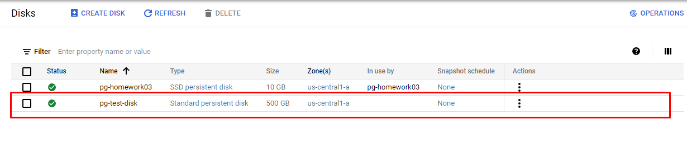
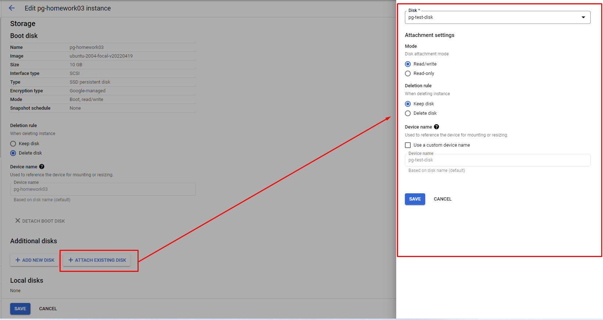
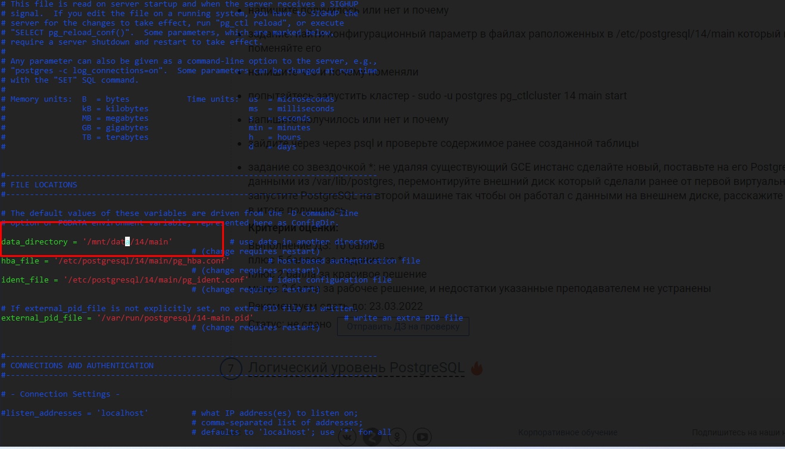

# Домашняя работа 3
## Установка и настройка PostgreSQL
Развернул виртуальную машину в GCP с именем pg-homework03	типа E2-medium

Обновил пакеты и установил postgresql 14
```
sudo apt-get update
sudo apt-get upgrade
sudo sh -c 'echo "deb http://apt.postgresql.org/pub/repos/apt $(lsb_release -cs)-pgdg main" > /etc/apt/sources.list.d/pgdg.list'
wget --quiet -O - https://www.postgresql.org/media/keys/ACCC4CF8.asc | sudo apt-key add -
sudo apt-get update
sudo apt-get install postgresql-14
```
Меняю пользователя на postgres что бы постоянно не вводить "sudo -u ..." и проверяю запущен ли кластер
```
anton@pg-homework03:~$ sudo su postgres
postgres@pg-homework03:/home/anton$ pg_lsclusters
Ver Cluster Port Status Owner    Data directory              Log file
14  main    5432 online postgres /var/lib/postgresql/14/main /var/log/postgresql/postgresql-14-main.log
```

запускаю psql, создаю таблицу и заполняю её данными
```
postgres@pg-homework03:/home/anton$ psql
psql (14.3 (Ubuntu 14.3-1.pgdg20.04+1))
Type "help" for help.

postgres=# create table test (id serial, value text);
CREATE TABLE
postgres=# insert into test(value) values('first value');
INSERT 0 1
postgres=# insert into test(value) values('second value');
INSERT 0 1
postgres=# insert into test(value) values('thred value');
INSERT 0 1
postgres=# insert into test(value) values('fourth value');
INSERT 0 1
```

выходу из psql и останавливаю кластер
```
postgres@pg-homework03:/home/anton$ pg_ctlcluster 14 main stop
Warning: stopping the cluster using pg_ctlcluster will mark the systemd unit as failed. Consider using systemctl:
  sudo systemctl stop postgresql@14-main

postgres@pg-homework03:/home/anton$ pg_lsclusters
Ver Cluster Port Status Owner    Data directory              Log file
14  main    5432 down   postgres /var/lib/postgresql/14/main /var/log/postgresql/postgresql-14-main.log
```

Создал новый диск pg-test-disk в GCP


Подключил его к ВМ


Создал раздел на диске
```
anton@pg-homework03:~$ sudo fdisk /dev/sdb

Welcome to fdisk (util-linux 2.34).
Changes will remain in memory only, until you decide to write them.
Be careful before using the write command.

Device does not contain a recognized partition table.
Created a new DOS disklabel with disk identifier 0x371b24c9.

Command (m for help): n
Partition type
   p   primary (0 primary, 0 extended, 4 free)
   e   extended (container for logical partitions)
Select (default p): p
Partition number (1-4, default 1):
First sector (2048-1048575999, default 2048):
Last sector, +/-sectors or +/-size{K,M,G,T,P} (2048-1048575999, default 1048575999):

Created a new partition 1 of type 'Linux' and of size 500 GiB.

Command (m for help): w
The partition table has been altered.
Calling ioctl() to re-read partition table.
Syncing disks.
```

Проверил через lsblk что раздел создан
```
anton@pg-homework03:~$ lsblk
NAME    MAJ:MIN RM  SIZE RO TYPE MOUNTPOINT
loop0     7:0    0 55.5M  1 loop /snap/core18/2344
loop1     7:1    0 61.9M  1 loop /snap/core20/1405
loop2     7:2    0  294M  1 loop /snap/google-cloud-sdk/235
loop3     7:3    0 67.8M  1 loop /snap/lxd/22753
loop4     7:4    0 43.6M  1 loop /snap/snapd/15177
sda       8:0    0   10G  0 disk
├─sda1    8:1    0  9.9G  0 part /
├─sda14   8:14   0    4M  0 part
└─sda15   8:15   0  106M  0 part /boot/efi
sdb       8:16   0  500G  0 disk
└─sdb1    8:17   0  500G  0 part
```
Создал файловую систему на разделе получил UUID раздела через blkid и настроил монтирование через /etc/fstab
```
anton@pg-homework03:~$ sudo mkfs.xfs /dev/sdb1
meta-data=/dev/sdb1              isize=512    agcount=4, agsize=32767936 blks
         =                       sectsz=4096  attr=2, projid32bit=1
         =                       crc=1        finobt=1, sparse=1, rmapbt=0
         =                       reflink=1
data     =                       bsize=4096   blocks=131071744, imaxpct=25
         =                       sunit=0      swidth=0 blks
naming   =version 2              bsize=4096   ascii-ci=0, ftype=1
log      =internal log           bsize=4096   blocks=63999, version=2
         =                       sectsz=4096  sunit=1 blks, lazy-count=1
realtime =none                   extsz=4096   blocks=0, rtextents=0

anton@pg-homework03:~$ sudo blkid
/dev/sda1: LABEL="cloudimg-rootfs" UUID="91842ad1-ec38-45c0-bf13-d346230ada21" TYPE="ext4" PARTUUID="0ad9b47d-8aac-4376-896f-3c4a6893f6e5"
/dev/sda15: LABEL_FATBOOT="UEFI" LABEL="UEFI" UUID="EE13-815A" TYPE="vfat" PARTUUID="8f067e10-a28e-4dcd-9285-f1ad4aa10fb8"
/dev/loop0: TYPE="squashfs"
/dev/loop1: TYPE="squashfs"
/dev/loop2: TYPE="squashfs"
/dev/loop3: TYPE="squashfs"
/dev/loop4: TYPE="squashfs"
/dev/sda14: PARTUUID="8b0decd8-4dde-44ed-92a7-27ed6bed7112"
/dev/sdb1: UUID="4e01f24b-9255-416f-a77b-e0d95d8ca698" TYPE="xfs" PARTUUID="371b24c9-01"

anton@pg-homework03:~$ sudo vim /etc/fstab

LABEL=cloudimg-rootfs   /        ext4   defaults        0 1
LABEL=UEFI      /boot/efi       vfat    umask=0077      0 1
UUID=4e01f24b-9255-416f-a77b-e0d95d8ca698 /mnt/data xfs defaults 0 0
```

Создал папку /mnt/data, примонтировал туда диск и проверил что все примонтировалось через lsblk
```
anton@pg-homework03:~$ sudo mkdir /mnt/data
anton@pg-homework03:~$ sudo mount -a
anton@pg-homework03:~$ lsblk
NAME    MAJ:MIN RM  SIZE RO TYPE MOUNTPOINT
loop0     7:0    0 55.5M  1 loop /snap/core18/2344
loop1     7:1    0 61.9M  1 loop /snap/core20/1405
loop2     7:2    0  294M  1 loop /snap/google-cloud-sdk/235
loop3     7:3    0 67.8M  1 loop /snap/lxd/22753
loop4     7:4    0 43.6M  1 loop /snap/snapd/15177
sda       8:0    0   10G  0 disk
├─sda1    8:1    0  9.9G  0 part /
├─sda14   8:14   0    4M  0 part
└─sda15   8:15   0  106M  0 part /boot/efi
sdb       8:16   0  500G  0 disk
└─sdb1    8:17   0  500G  0 part /mnt/data
```

Перезагрузил ВМ и проверил что диск примонтирован(в принципе можно было и не делать, т.к. "mount -a" перечитывает fstab аналогично как при загрузке системы)

Заново остановил кластер т.к. при перезагрузке он заново стратовал, создал владельцем папки /mnt/data postgres и перенес данные postgresql из /var/lib/postgres/14 в /mnt/data(перенос делал от имени пользователя postgres что бы потом не пришлось менять права на перенесенные файлы)
```
anton@pg-homework03:~$ sudo -u postgres pg_lsclusters
Ver Cluster Port Status Owner    Data directory              Log file
14  main    5432 online postgres /var/lib/postgresql/14/main /var/log/postgresql/postgresql-14-main.log

anton@pg-homework03:~$ sudo -u postgres pg_ctlcluster 14 main stop
Warning: stopping the cluster using pg_ctlcluster will mark the systemd unit as failed. Consider using systemctl:
  sudo systemctl stop postgresql@14-main

anton@pg-homework03:~$ sudo -u postgres pg_lsclusters
Ver Cluster Port Status Owner    Data directory              Log file
14  main    5432 down   postgres /var/lib/postgresql/14/main /var/log/postgresql/postgresql-14-main.log

anton@pg-homework03:~$ sudo chown postgres:postgres /mnt/data/

anton@pg-homework03:~$ ls -lah /mnt
total 8.0K
drwxr-xr-x  3 root     root     4.0K May 27 10:37 .
drwxr-xr-x 19 root     root     4.0K May 27 10:42 ..
drwxr-xr-x  2 postgres postgres    6 May 27 10:31 data

anton@pg-homework03:~$ sudo -u postgres mv /var/lib/postgresql/14/ /mnt/data/

anton@pg-homework03:~$ ls -lah /mnt/data/
total 4.0K
drwxr-xr-x 3 postgres postgres   16 May 27 10:51 .
drwxr-xr-x 3 root     root     4.0K May 27 10:37 ..
drwxr-xr-x 3 postgres postgres   18 May 27 08:10 14
```

Пробую запустить кластер и получаю ошибку
```
anton@pg-homework03:~$ sudo -u postgres pg_ctlcluster 14 main start
Error: /var/lib/postgresql/14/main is not accessible or does not exist
```

Ошибка вызвана тем что postgres пытается запуститься из неверной data_directory. Меняю настройки data_directory в /etc/postgresql/14/main/postgresql.conf
```
anton@pg-homework03:~$ sudo vim /etc/postgresql/14/main/postgresql.conf
```


Пробую повторно запустить кластер. Кластер запустился
```
anton@pg-homework03:~$ sudo -u postgres pg_ctlcluster 14 main start
Warning: the cluster will not be running as a systemd service. Consider using systemctl:
  sudo systemctl start postgresql@14-main
anton@pg-homework03:~$ sudo -u postgres pg_lsclusters
Ver Cluster Port Status Owner    Data directory    Log file
14  main    5432 online postgres /mnt/data/14/main /var/log/postgresql/postgresql-14-main.log
```

Подключился через psql. Подключение прошло успешно. Данные на месте
```
anton@pg-homework03:~$ sudo -u postgres psql
psql (14.3 (Ubuntu 14.3-1.pgdg20.04+1))
Type "help" for help.

postgres=# \dt
        List of relations
 Schema | Name | Type  |  Owner
--------+------+-------+----------
 public | test | table | postgres
(1 row)

postgres=# select * from test;
 id |    value
----+--------------
  1 | first value
  2 | second value
  3 | thred value
  4 | fourth value
(4 rows)
```
