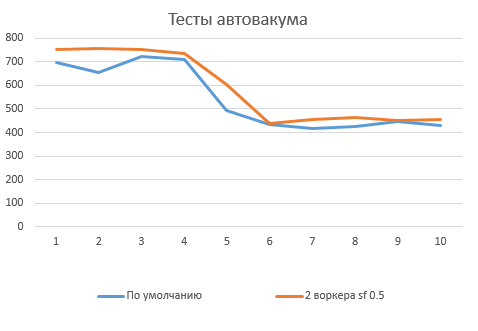
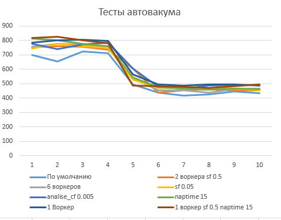
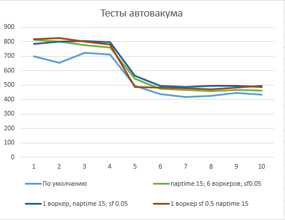

# Домашняя Работа 5
## Настройка autovacuum с учетом оптимальной производительности
Создал инстанс VM e2-medium в GCP с именем pg-homework05 обновил пакеты и установил postgresql-14
```
sudo apt-get update && sudo apt-get upgrade -y
sudo sh -c 'echo "deb http://apt.postgresql.org/pub/repos/apt $(lsb_release -cs)-pgdg main" > /etc/apt/sources.list.d/pgdg.list'
wget --quiet -O - https://www.postgresql.org/media/keys/ACCC4CF8.asc | sudo apt-key add -
sudo apt-get update
sudo apt-get install postgresql-14
```

Проверяем что кластер стартовал
```
anton@pg-homework05:~$ sudo -u postgres pg_lsclusters
Ver Cluster Port Status Owner    Data directory              Log file
14  main    5432 online postgres /var/lib/postgresql/14/main /var/log/postgresql/postgresql-14-main.log
```

Подключаемся через psql и првавим настройки кластера в соответствии с приложеным файлом к ДЗ
```
anton@pg-homework05:~$ sudo -u postgres psql
psql (14.3 (Ubuntu 14.3-1.pgdg20.04+1))
Type "help" for help.

postgres=# alter system set max_connections to 40;
ALTER SYSTEM
postgres=# alter system set shared_buffers to '1GB';
ALTER SYSTEM
postgres=# alter system set effective_cache_size to '3GB';
ALTER SYSTEM
postgres=# alter system set maintenance_work_mem to '512MB';
ALTER SYSTEM
postgres=# alter system set checkpoint_completion_target to 0.9;
ALTER SYSTEM
postgres=# alter system set wal_buffers to '16MB';
ALTER SYSTEM
postgres=# alter system set default_statistics_target to 500;
ALTER SYSTEM
postgres=# alter system set random_page_cost to 4;
ALTER SYSTEM
postgres=# alter system set effective_io_concurrency to 2;
ALTER SYSTEM
postgres=# alter system set work_mem to '6553kB';
ALTER SYSTEM
postgres=# alter system set min_wal_size to '4GB';
ALTER SYSTEM
postgres=# alter system set max_wal_size to '16GB';
ALTER SYSTEM
```

Изходя из запроса не все настройки применились
```
postgres=# select name, setting, pending_restart from pg_settings where name in ('max_connections', 'shared_buffers', 'effective_cache_size', 'maintenance_work_mem','checkpoint_completion_target','wal_buffers','default_statistics_target','random_page_cost','effective_io_concurrency','work_mem','min_wal_size','max_wal_size');
             name             | setting | pending_restart
------------------------------+---------+-----------------
 checkpoint_completion_target | 0.9     | f
 default_statistics_target    | 100     | f
 effective_cache_size         | 524288  | f
 effective_io_concurrency     | 1       | f
 maintenance_work_mem         | 65536   | f
 max_connections              | 100     | f
 max_wal_size                 | 1024    | f
 min_wal_size                 | 80      | f
 random_page_cost             | 4       | f
 shared_buffers               | 16384   | f
 wal_buffers                  | 512     | f
 work_mem                     | 4096    | f
(12 rows)
```

перезагружаем кластер
```
anton@pg-homework05:~$ sudo -u postgres pg_ctlcluster 14 main stop
Warning: stopping the cluster using pg_ctlcluster will mark the systemd unit as failed. Consider using systemctl:
  sudo systemctl stop postgresql@14-main

anton@pg-homework05:~$ sudo -u postgres pg_lsclusters
Ver Cluster Port Status Owner    Data directory              Log file
14  main    5432 down   postgres /var/lib/postgresql/14/main /var/log/postgresql/postgresql-14-main.log

anton@pg-homework05:~$ sudo -u postgres pg_ctlcluster 14 main start
Warning: the cluster will not be running as a systemd service. Consider using systemctl:
  sudo systemctl start postgresql@14-main

anton@pg-homework05:~$ sudo -u postgres pg_lsclusters
Ver Cluster Port Status Owner    Data directory              Log file
14  main    5432 online postgres /var/lib/postgresql/14/main /var/log/postgresql/postgresql-14-main.log
```

Проверяем применились ли настройки
```
postgres=# select name, setting, pending_restart from pg_settings where name in ('max_connections', 'shared_buffers', 'effective_cache_size', 'maintenance_work_mem','checkpoint_completion_target','wal_buffers','default_statistics_target','random_page_cost','effective_io_concurrency','work_mem','min_wal_size','max_wal_size');
             name             | setting | pending_restart
------------------------------+---------+-----------------
 checkpoint_completion_target | 0.9     | f
 default_statistics_target    | 500     | f
 effective_cache_size         | 393216  | f
 effective_io_concurrency     | 2       | f
 maintenance_work_mem         | 524288  | f
 max_connections              | 40      | f
 max_wal_size                 | 16384   | f
 min_wal_size                 | 4096    | f
 random_page_cost             | 4       | f
 shared_buffers               | 131072  | f
 wal_buffers                  | 2048    | f
 work_mem                     | 6553    | f
(12 rows)
```

Настрйки применены. Заходим в систему под пользователем postgres и запускаем инициализацию pgbench
```
anton@pg-homework05:~$ sudo su postgres

postgres@pg-homework05:/home/anton$ pgbench -i postgres
dropping old tables...
NOTICE:  table "pgbench_accounts" does not exist, skipping
NOTICE:  table "pgbench_branches" does not exist, skipping
NOTICE:  table "pgbench_history" does not exist, skipping
NOTICE:  table "pgbench_tellers" does not exist, skipping
creating tables...
generating data (client-side)...
100000 of 100000 tuples (100%) done (elapsed 0.12 s, remaining 0.00 s)
vacuuming...
creating primary keys...
done in 0.59 s (drop tables 0.00 s, create tables 0.01 s, client-side generate 0.33 s, vacuum 0.16 s, primary keys 0.09 s).
```

Запускаем тест pgbench
```
postgres@pg-homework05:/home/anton$ pgbench -c8 -P 60 -T 600 -U postgres postgres
pgbench (14.3 (Ubuntu 14.3-1.pgdg20.04+1))
starting vacuum...end.
progress: 60.0 s, 698.6 tps, lat 11.422 ms stddev 5.970
progress: 120.0 s, 654.7 tps, lat 12.197 ms stddev 6.294
progress: 180.0 s, 722.1 tps, lat 11.055 ms stddev 5.732
progress: 240.0 s, 709.4 tps, lat 11.257 ms stddev 5.741
progress: 300.1 s, 495.2 tps, lat 16.096 ms stddev 20.991
progress: 360.1 s, 436.1 tps, lat 18.311 ms stddev 26.869
progress: 420.1 s, 416.9 tps, lat 19.130 ms stddev 28.160
progress: 480.1 s, 423.5 tps, lat 18.846 ms stddev 27.352
progress: 540.1 s, 446.4 tps, lat 17.869 ms stddev 27.172
progress: 600.1 s, 431.9 tps, lat 18.474 ms stddev 27.220
transaction type: <builtin: TPC-B (sort of)>
scaling factor: 1
query mode: simple
number of clients: 8
number of threads: 1
duration: 600 s
number of transactions actually processed: 326125
latency average = 14.686 ms
latency stddev = 19.144 ms
initial connection time = 31.110 ms
tps = 543.480511 (without initial connection time)
```

Проверяем настройки автовакума
```
postgres=# select name, setting, pending_restart from pg_settings where name like 'autovacuum%';
                 name                  |  setting  | pending_restart
---------------------------------------+-----------+-----------------
 autovacuum                            | on        | f
 autovacuum_analyze_scale_factor       | 0.1       | f
 autovacuum_analyze_threshold          | 50        | f
 autovacuum_freeze_max_age             | 200000000 | f
 autovacuum_max_workers                | 3         | f
 autovacuum_multixact_freeze_max_age   | 400000000 | f
 autovacuum_naptime                    | 60        | f
 autovacuum_vacuum_cost_delay          | 2         | f
 autovacuum_vacuum_cost_limit          | -1        | f
 autovacuum_vacuum_insert_scale_factor | 0.2       | f
 autovacuum_vacuum_insert_threshold    | 1000      | f
 autovacuum_vacuum_scale_factor        | 0.2       | f
 autovacuum_vacuum_threshold           | 50        | f
 autovacuum_work_mem                   | -1        | f
(14 rows)
```
Корректируем настройки автовакума. Устанавливаем количество воркеров равное количеству провессоров и меняем scale factor на 0,5
```
postgres=# ALTER SYSTEM SET autovacuum_max_workers TO 2;
ALTER SYSTEM
postgres=# ALTER SYSTEM SET autovacuum_vacuum_scale_factor to 0.5;
ALTER SYSTEM
```
Перезагружаем кластер и запускаем тест


Далее был предпринят ряд тестов с различной конфигурацией воркеров, скейлфактора, наптайма и т.д.

Результаты всех тестов на скриншоте ниже


Практически все конфигурации были немного лучше дефолтной, но каких либо существенных отличий между ними добиться не удалось. Возможно это связано с тем что PG работает на ВМ

Наиболее интересные показатели были после изменения naptime до 15. Ниже 3 последних конфигурации по сравнению с дефолтной

