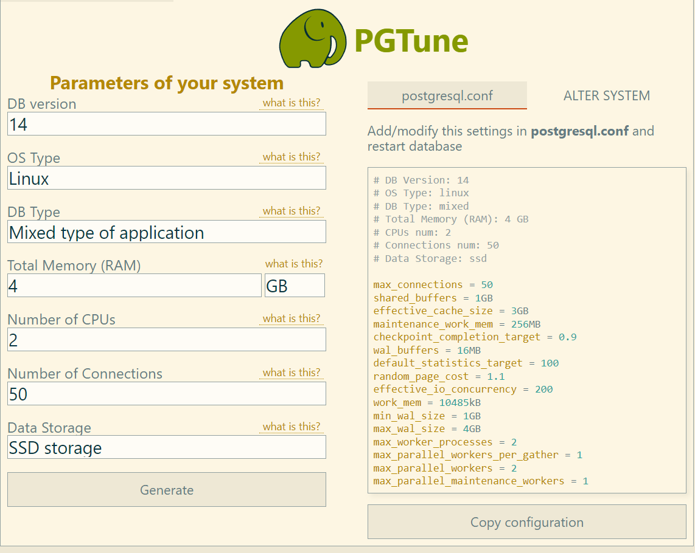

# Домашняя работа 8
## Нагрузочное тестирование и тюнинг PostgreSQL


Создал инстанс VM e2-medium в GCP с именем pg-homework08 обновил пакеты и установил postgresql-14
```
sudo apt-get update && sudo apt-get upgrade -y
sudo sh -c 'echo "deb http://apt.postgresql.org/pub/repos/apt $(lsb_release -cs)-pgdg main" > /etc/apt/sources.list.d/pgdg.list'
wget --quiet -O - https://www.postgresql.org/media/keys/ACCC4CF8.asc | sudo apt-key add -
sudo apt-get update && sudo apt-get install -y postgresql-14
```

Заходим под пользователем postgres, инициализируем и запускаем pgbench с дефолтными параметрами сервера
```
anton@pg-homework08:~$ sudo su postgres

postgres@pg-homework08:/home/anton$ pgbench -i postgres
dropping old tables...
NOTICE:  table "pgbench_accounts" does not exist, skipping
NOTICE:  table "pgbench_branches" does not exist, skipping
NOTICE:  table "pgbench_history" does not exist, skipping
NOTICE:  table "pgbench_tellers" does not exist, skipping
creating tables...
generating data (client-side)...
100000 of 100000 tuples (100%) done (elapsed 0.12 s, remaining 0.00 s)
vacuuming...
creating primary keys...
done in 0.50 s (drop tables 0.01 s, create tables 0.04 s, client-side generate 0.29 s, vacuum 0.08 s, primary keys 0.08 s).

postgres@pg-homework08:/home/anton$ pgbench -c16 -P 60 -T 600 -U postgres postgres
pgbench (14.3 (Ubuntu 14.3-1.pgdg18.04+1))
starting vacuum...end.
progress: 60.0 s, 752.9 tps, lat 21.232 ms stddev 13.142
progress: 120.0 s, 748.5 tps, lat 21.374 ms stddev 13.229
progress: 180.0 s, 733.7 tps, lat 21.801 ms stddev 13.152
progress: 240.0 s, 751.9 tps, lat 21.281 ms stddev 12.989
progress: 300.0 s, 746.1 tps, lat 21.442 ms stddev 13.043
progress: 360.0 s, 755.3 tps, lat 21.179 ms stddev 12.882
progress: 420.0 s, 738.6 tps, lat 21.661 ms stddev 13.160
progress: 480.0 s, 504.8 tps, lat 31.652 ms stddev 34.231
progress: 540.0 s, 486.7 tps, lat 32.863 ms stddev 36.886
progress: 600.0 s, 496.8 tps, lat 32.197 ms stddev 36.350
transaction type: <builtin: TPC-B (sort of)>
scaling factor: 1
query mode: simple
number of clients: 16
number of threads: 1
duration: 600 s
number of transactions actually processed: 402957
latency average = 23.822 ms
latency stddev = 20.938 ms
initial connection time = 30.641 ms
tps = 671.560585 (without initial connection time)
```
Получаем средний TPS 671.

Пробуем настроить сервер через сервер https://pgtune.leopard.in.ua/. получаем следующее


Копируем предложенную конфигурацию в конец файла /etc/postgresql/14/main/postgresql.conf и презагружаем кластер
```
anton@pg-homework08:~$ sudo vim /etc/postgresql/14/main/postgresql.conf
anton@pg-homework08:~$ sudo pg_ctlcluster 14 main restart
```

Запускаем тестированирование
```
postgres@pg-homework08:/home/anton$ pgbench -c16 -P 60 -T 600 -U postgres postgres
pgbench (14.3 (Ubuntu 14.3-1.pgdg18.04+1))
starting vacuum...end.
progress: 60.0 s, 805.1 tps, lat 19.858 ms stddev 12.385
progress: 120.0 s, 796.6 tps, lat 20.082 ms stddev 12.039
progress: 180.0 s, 798.2 tps, lat 20.044 ms stddev 12.165
progress: 240.0 s, 798.6 tps, lat 20.032 ms stddev 12.298
progress: 300.0 s, 811.7 tps, lat 19.710 ms stddev 12.142
progress: 360.0 s, 799.5 tps, lat 20.011 ms stddev 12.391
progress: 420.0 s, 785.2 tps, lat 20.374 ms stddev 12.611
progress: 480.0 s, 792.4 tps, lat 20.190 ms stddev 11.981
progress: 540.0 s, 707.9 tps, lat 22.591 ms stddev 20.862
progress: 600.0 s, 537.4 tps, lat 29.771 ms stddev 33.791
transaction type: <builtin: TPC-B (sort of)>
scaling factor: 1
query mode: simple
number of clients: 16
number of threads: 1
duration: 600 s
number of transactions actually processed: 457972
latency average = 20.959 ms
latency stddev = 15.902 ms
initial connection time = 27.865 ms
tps = 763.277248 (without initial connection time)
```
Прирост составил около 13%.

Пробуем еще увеличить производительность. Учитывая что в задании сказано "не
обращая внимание на возможные проблемы с надежностью", отключаем synchronous_commit
```
postgres@pg-homework08:/home/anton$ pgbench -c16 -P 60 -T 600 -U postgres postgres
pgbench (14.3 (Ubuntu 14.3-1.pgdg18.04+1))
starting vacuum...end.
progress: 60.0 s, 2579.4 tps, lat 6.199 ms stddev 2.932
progress: 120.0 s, 2580.1 tps, lat 6.192 ms stddev 2.966
progress: 180.0 s, 1291.8 tps, lat 12.376 ms stddev 28.575
progress: 240.0 s, 1276.2 tps, lat 12.534 ms stddev 29.044
progress: 300.0 s, 1289.1 tps, lat 12.411 ms stddev 28.711
progress: 360.0 s, 1306.7 tps, lat 12.243 ms stddev 28.487
progress: 420.0 s, 1305.9 tps, lat 12.251 ms stddev 28.594
progress: 480.0 s, 1276.7 tps, lat 12.531 ms stddev 29.149
progress: 540.0 s, 1298.1 tps, lat 12.324 ms stddev 28.591
progress: 600.0 s, 1303.4 tps, lat 12.274 ms stddev 28.605
transaction type: <builtin: TPC-B (sort of)>
scaling factor: 1
query mode: simple
number of clients: 16
number of threads: 1
duration: 600 s
number of transactions actually processed: 930580
latency average = 10.315 ms
latency stddev = 23.705 ms
initial connection time = 29.303 ms
tps = 1550.853511 (without initial connection time)
```
Прирост производительности существенный(около 130%). Пробуем еще увеличить скорость отключи fsync(отключить его можно только через файл конфига)
```
anton@pg-homework08:~$ sudo vim /etc/postgresql/14/main/postgresql.conf
anton@pg-homework08:~$ antonpg_ctlcluster 14 main restart
anton@pg-homework08:~$ sudo su postgres
postgres@pg-homework08:/home/anton$ psql -c 'show fsync'
 fsync
-------
 off
(1 row)

postgres@pg-homework08:/home/anton$ pgbench -c16 -P 60 -T 600 -U postgres postgres
pgbench (14.3 (Ubuntu 14.3-1.pgdg18.04+1))
starting vacuum...end.
progress: 60.0 s, 2565.2 tps, lat 6.232 ms stddev 2.919
progress: 120.1 s, 2552.7 tps, lat 6.257 ms stddev 3.006
progress: 180.1 s, 1281.1 tps, lat 12.479 ms stddev 28.823
progress: 240.1 s, 1259.6 tps, lat 12.698 ms stddev 29.236
progress: 300.1 s, 1280.3 tps, lat 12.494 ms stddev 28.756
progress: 360.1 s, 1279.0 tps, lat 12.507 ms stddev 28.777
progress: 420.1 s, 1285.4 tps, lat 12.444 ms stddev 28.741
progress: 480.1 s, 1302.3 tps, lat 12.285 ms stddev 28.534
progress: 540.1 s, 1283.9 tps, lat 12.461 ms stddev 28.761
progress: 600.1 s, 1259.2 tps, lat 12.702 ms stddev 29.495
transaction type: <builtin: TPC-B (sort of)>
scaling factor: 1
query mode: simple
number of clients: 16
number of threads: 1
duration: 600 s
number of transactions actually processed: 921148
latency average = 10.421 ms
latency stddev = 23.835 ms
initial connection time = 32.772 ms
tps = 1535.057192 (without initial connection time)
```
прироста нет. Видимо из за того что в ВМ используется SSD диск который и так довольно быстро пишет данные. Возвращаем параметр в on и пробуем отключить full_page_writes
```
postgres@pg-homework08:/home/anton$ exit
exit
anton@pg-homework08:~$ sudo vim /etc/postgresql/14/main/postgresql.conf
anton@pg-homework08:~$ antonpg_ctlcluster 14 main restart
anton@pg-homework08:~$ sudo su postgres
postgres@pg-homework08:/home/anton$ psql -c 'show full_page_writes'
 full_page_writes
------------------
 off
(1 row)

postgres@pg-homework08:/home/anton$ pgbench -c16 -P 60 -T 600 -U postgres postgres
pgbench (14.3 (Ubuntu 14.3-1.pgdg18.04+1))
starting vacuum...end.
progress: 60.0 s, 2565.6 tps, lat 6.232 ms stddev 2.999
progress: 120.0 s, 2590.2 tps, lat 6.176 ms stddev 2.911
progress: 180.1 s, 1298.6 tps, lat 12.294 ms stddev 28.509
progress: 240.1 s, 1287.8 tps, lat 12.423 ms stddev 28.709
progress: 300.1 s, 1264.7 tps, lat 12.650 ms stddev 29.330
progress: 360.1 s, 1294.2 tps, lat 12.360 ms stddev 28.630
progress: 420.1 s, 1301.4 tps, lat 12.291 ms stddev 28.571
progress: 480.1 s, 1280.3 tps, lat 12.496 ms stddev 28.785
progress: 540.1 s, 1306.2 tps, lat 12.246 ms stddev 28.444
progress: 600.1 s, 1284.3 tps, lat 12.457 ms stddev 28.806
transaction type: <builtin: TPC-B (sort of)>
scaling factor: 1
query mode: simple
number of clients: 16
number of threads: 1
duration: 600 s
number of transactions actually processed: 928561
latency average = 10.339 ms
latency stddev = 23.703 ms
initial connection time = 31.909 ms
tps = 1547.322019 (without initial connection time)
```
Существенного прироста так же нет. Возвращаем параметр обратно и пробуем подкоректировать настройки автовакума
autovacuum_naptime=15s
autovacuum_vacuum_scale_factor=0.05
autovacuum_analyze_scale_factor=0.05
autovacuum_max_workers=2
Запускаем тест
```
postgres@pg-homework08:/home/anton$ pgbench -c16 -P 60 -T 600 -U postgres postgres
pgbench (14.3 (Ubuntu 14.3-1.pgdg18.04+1))
starting vacuum...end.
progress: 60.0 s, 2586.7 tps, lat 6.181 ms stddev 3.162
progress: 120.0 s, 2582.8 tps, lat 6.194 ms stddev 3.385
progress: 180.0 s, 1292.6 tps, lat 12.376 ms stddev 28.720
progress: 240.0 s, 1302.7 tps, lat 12.281 ms stddev 28.718
progress: 300.0 s, 1301.1 tps, lat 12.296 ms stddev 28.667
progress: 360.0 s, 1298.8 tps, lat 12.317 ms stddev 28.561
progress: 420.0 s, 1278.9 tps, lat 12.507 ms stddev 28.967
progress: 480.0 s, 1274.2 tps, lat 12.556 ms stddev 29.124
progress: 540.0 s, 1256.9 tps, lat 12.726 ms stddev 29.321
progress: 600.0 s, 1293.2 tps, lat 12.369 ms stddev 28.775
transaction type: <builtin: TPC-B (sort of)>
scaling factor: 1
query mode: simple
number of clients: 16
number of threads: 1
duration: 600 s
number of transactions actually processed: 928101
latency average = 10.342 ms
latency stddev = 23.804 ms
initial connection time = 32.170 ms
tps = 1546.837271 (without initial connection time)
```
Существенных изменений так же нет.

### Вывод
При настройках в условиях реального железа full_page_writes и fsync возможно дали бы еще прироста производительности но в условиях вм этого не происходит, поэтому можно было бы ограничиться только отключением synchronous_commit и настройками которые были сделаны в первом тесте после изменения конфигурации
